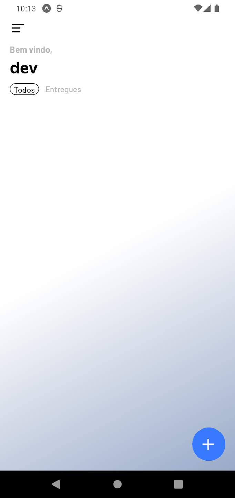

# DuckTrack Core

## Descrição

Este projeto foi cuidadosamente desenvolvido com foco em boas práticas de programação, incorporando conceitos de clean code e programação orientada a objetos (POO). A modularidade é evidente, seguindo o princípio da responsabilidade única, e a eficiência é maximizada com o uso de filas e cache (utilizando Redis).

A base tecnológica é sólida, com Node.js e TypeScript impulsionando o back-end, Express para a construção de APIs robustas, e tudo isso gerenciado em containers Docker, equilibrados com Nginx.

A segurança é uma prioridade, sendo implementada autenticação com tokens para garantir a proteção dos dados sensíveis. Além disso, o aplicativo oferece notificações em tempo real por meio de push notifications usando o Firebase.

O banco de dados é alimentado pelo MongoDB, uma escolha que combina perfeitamente com a flexibilidade e escalabilidade necessárias para um sistema de rastreamento de encomendas.

Por fim, o App é construído sobre o ecossistema Expo, aproveitando o poder do TypeScript para criar uma experiência de usuário fluida e consistente.

## Tecnologias Utilizadas

Dê uma olhada nas tecnologias:

  

## App

  
  
  

